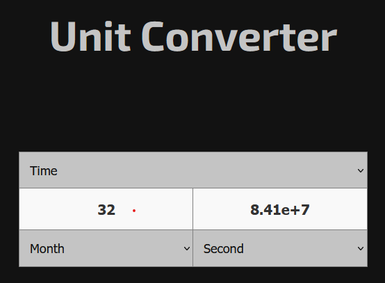

# Unit Converter

A simple and responsive unit converter built with HTML, CSS, and JavaScript. This project allows users to convert between different units of measurement, including energy, area, mass, volume, frequency, length, pressure, temperature, time, speed, and currency.

## Features

- Supports multiple unit categories.
- Automatic conversion between selected units.
- Temperature conversion with specific formulas.
- Live exchange rates for currency conversion (powered by CoinGecko API).
- Responsive and user-friendly interface.

## Technologies Used

- HTML
- CSS
- JavaScript
- CoinGecko API

## Installation & Usage

1. Clone this repository:
   ```bash
   git clone https://github.com/your-username/unit-converter.git
   ```
2. Navigate to the project directory:
   ```bash
   cd unit-converter
   ```
3. Open `index.html` in your browser.

## How It Works

- Select a unit category from the dropdown menu.
- Enter a value in one of the input fields.
- The corresponding value in the other unit is automatically calculated.
- For currency conversion, exchange rates are fetched from the CoinGecko API every minute.

## Screenshot



## API Usage

The project fetches real-time exchange rates using the [CoinGecko API](https://www.coingecko.com/):

```javascript
fetch("https://api.coingecko.com/api/v3/simple/price?ids=usd,bitcoin,ethereum&vs_currencies=eur,gbp,jpy,usd")
    .then(response => response.json())
    .then(data => {
        units.money.euro = data.usd.eur;
        units.money.pound = data.usd.gbp;
        units.money.yen = data.usd.jpy;
        units.money.bitcoin = data.bitcoin.usd;
        units.money.ethereum = data.ethereum.usd;
    })
    .catch(error => console.error("Error fetching exchange rates:", error));
```

## Contributing

Feel free to fork this repository and submit pull requests with improvements or additional features.

## Acknowledgment

This project was inspired by Google converter and built using HTML, CSS, and JavaScript. Currency exchange rates are provided by CoinGecko.

## License

This project is licensed under the MIT License.
